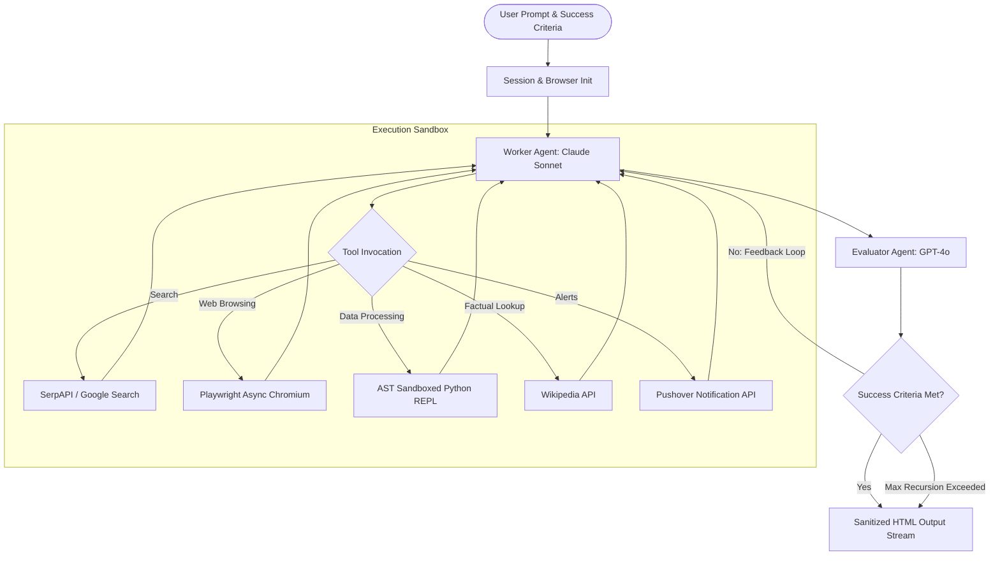

# Architecture: Sidekick AI Agent

## Overview

Sidekick AI Agent is an autonomous, goal-driven multi-agent system designed for multi-step web research, headless browser automation, and sandboxed code execution. It implements the **Worker-Evaluator (Evaluator-Optimizer)** design pattern using **LangGraph**.

---

## Core Components

### 1. User Interface Layer (`app.py`)
- **Framework:** Gradio 5.x with custom CSS and direct HTML stream rendering.
- **Responsibilities:**
  - Collects `Requirements` and `Success Criteria`.
  - Manages asynchronous user sessions (`gr.State`) and ensures graceful resource cleanup (`free_resources` -> Playwright browser shutdown).
  - Renders real-time, sanitized step-by-step agent logs (User, Agent, Evaluator feedback) with zero XSS vulnerability.
  - Rate-limited queue (`default_concurrency_limit=2`, `max_size=10`) to prevent abuse on public spaces.

### 2. Orchestration Layer (`sidekick.py`)
- **Framework:** LangGraph `StateGraph`.
- **Key State Variables (`State`):**
  - `messages`: Annotated message history with `add_messages` reducer.
  - `success_criteria`: User-defined criteria for task completion.
  - `feedback_on_work`: Specific feedback generated by the Evaluator when criteria are not met.
  - `success_criteria_met`: Boolean flag controlling workflow termination.
  - `user_input_needed`: Boolean flag when user clarification is requested.
- **Agents:**
  - **Worker Agent:** Powered by `anthropic/claude-3.5-haiku` (via OpenRouter), bound with tool suite.
  - **Evaluator Agent:** Powered by `openai/gpt-4o-mini` (via OpenRouter), using structured output (`EvaluatorOutput`).
- **Loop Protection:** Recursion limit set to 20 iterations.

### 3. Tool & Security Layer (`sidekick_tools.py`)
- **Enterprise Export Engine:**
  - `generate_excel_report`: Uses `openpyxl` and `pandas` to generate styled `.xlsx` workbooks with custom header colors, auto-sized columns, and alternating row styling.
  - `generate_executive_pdf`: Uses `reportlab` to build formatted Executive PDF Briefs with callout boxes, structured section headings, and data tables.
- **Playwright Headless Browser:**
  - Async Chromium instance managed per session.
  - Programmatic SSRF guardrails (`is_safe_url`): blocks loopback (`127.0.0.1`), RFC 1918 private subnets (`10.x`, `172.16.x`, `192.168.x`), AWS/Cloud metadata IPs (`169.254.169.254`), and unsupported protocols.
- **Sandboxed Python REPL:**
  - AST validation (`validate_python_code_ast`) prohibits dunder attributes (`__class__`, `__globals__`), dangerous builtins (`eval`, `exec`, `open`), and imports.
  - Restricts execution to whitelist modules (`math`, `statistics`, `random`, `datetime`, `json`, `re`, `collections`, `itertools`, `pandas`).
- **External Connectors:**
  - SerpAPI for multi-step search engine queries.
  - Wikipedia API wrapper for encyclopedic facts.
  - Pushover push notifications (rate-limited to 2 per session).

### 4. Ephemeral Session Manager (`session_manager.py`)
- Isolated browser session directory generation (`sandbox/reports/<session_id>/`).
- Ephemeral lifecycle: Purges all files automatically on session reset or disconnect, guaranteeing zero persistent local disk leakage.

