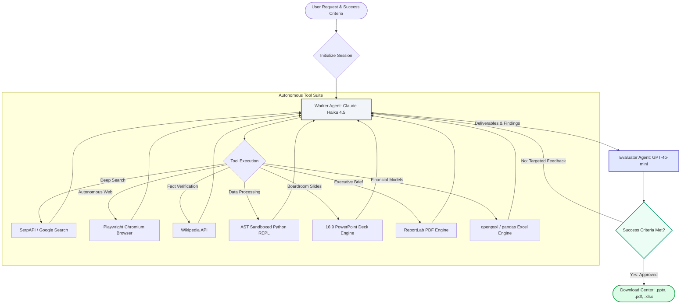

# ⚡ Sidekick AI Agent (Enterprise Edition)

**Full Automation & Intelligence Agent for the Modern Enterprise.**

Sidekick is an autonomous, multi-agent AI system engineered for complex due diligence, market research, and executive-ready deliverables generation. Powered by **LangGraph** and high-performance **OpenRouter** models, Sidekick independently browses the web, executes sandboxed Python computations, synthesizes competitive intelligence, and automatically produces downloadable **PowerPoint (.pptx)** presentations, **Executive PDF** briefs, and **Excel (.xlsx)** matrices.

---

## 🚀 Key Highlights & Capabilities

### 📊 1. Boardroom-Ready Deliverables Suite
* **16:9 Executive PowerPoint Decks (`.pptx`):** Generates consulting-grade (McKinsey/Gartner-styled) widescreen presentation decks complete with executive hero title slides, multi-column comparison cards, structured bullet takeaways, and strategic takeaway callouts powered by `python-pptx`.
* **Executive Intelligence PDF Briefs (`.pdf`):** Generates formatted multi-page executive briefs featuring key takeaway callout boxes, digestible section paragraphs, styled dark header tables, and actionable recommendation summaries powered by `reportlab`.
* **Enterprise Excel Analytics (`.xlsx`):** Generates structured workbooks with styled header rows, auto-sized columns, and alternating row styling powered by `openpyxl` and `pandas`.

### 🛡️ 2. Ephemeral Session Isolation (Zero Local Storage Footprint)
* Designed specifically for modern web portfolios and multi-tenant environments.
* Long-term state and session artifacts are strictly isolated per browser session in temporary directories (`sandbox/reports/<session_id>/`).
* Ephemeral artifacts are automatically purged upon session reset or browser disconnection, guaranteeing strict data isolation and zero persistent local footprint.

### 🧠 3. Autonomous Multi-Agent Orchestration (Worker-Evaluator Pattern)
* **Worker Agent:** Powered by `anthropic/claude-haiku-4.5` (via OpenRouter) equipped with deep web browsing, SerpAPI, Wikipedia, safe Python REPL, and file generation tools.
* **Evaluator Agent:** Powered by `openai/gpt-4o-mini` (via OpenRouter) using structured Pydantic schema validation to verify task completion and deliverable creation against strict success criteria.
* **Deep Research Capacity:** Configured with a 45-step recursion limit and 300-second timeout to handle multi-step investigative workflows without truncation.

---

## 🏗️ System Architecture



---

## 🔒 Security Hardening & Guardrails

Sidekick is built to enterprise security standards and hardened against top AI/web attack vectors:

* **AST-Based Python Sandboxing:** Code executed by the REPL undergoes Abstract Syntax Tree (AST) validation (`validate_python_code_ast`), prohibiting dunder access (`__class__`, `__globals__`), dangerous builtins (`eval`, `exec`, `open`, `getattr`), and dynamic imports. Whitelisted modules: `math`, `statistics`, `random`, `datetime`, `json`, `re`, `collections`, `itertools`, `pandas`.
* **Programmatic SSRF & DNS Guardrails:** Browser navigation is actively protected (`is_safe_url`), blocking loopback (`127.0.0.1`, `localhost`), private RFC 1918 subnets (`10.0.0.0/8`, `172.16.0.0/12`, `192.168.0.0/16`), AWS/Cloud metadata IPs (`169.254.169.254`), and unsupported protocols.
* **XSS & HTML Sanitization:** Log messages, evaluator feedback, and assistant outputs are escaped using `html.escape()` before rendering.
* **API Key Memory Isolation:** Credentials are purged from global environment space (`os.environ`) immediately upon initialization.
* **Session Rate Limiting & Concurrency Controls:** Gradio queue concurrency limits (`default_concurrency_limit=2`, `max_size=10`) protect backend infrastructure from request flooding.

---

## 🛠️ Setup & Installation

### Prerequisites
* **Python 3.13.x** (Recommended for LangChain / Pydantic compatibility)
* Modern web browser (Chrome, Edge, Firefox, Safari)

### 1. Clone & Configure Environment
```bash
git clone https://github.com/Samrude1/sidekick-ai-agent.git
cd sidekick-ai-agent
```

Create a `.env` file in the project root:
```env
OPENROUTER_API_KEY=your_openrouter_api_key_here
SERPAPI_API_KEY=your_serpapi_key_here

# Optional: Push notification alerts
PUSHOVER_TOKEN=your_pushover_token
PUSHOVER_USER=your_pushover_user
```

### 2. Set Up Virtual Environment & Dependencies
```powershell
# Windows
python -m venv .venv
.\.venv\Scripts\activate

# Install requirements
pip install -r requirements.txt

# Install Playwright browser binaries
playwright install
```

```bash
# macOS / Linux
python3 -m venv .venv
source .venv/bin/activate
pip install -r requirements.txt
playwright install
```

### 3. Run the Application
```powershell
python app.py
```
Open **http://127.0.0.1:7860** in your browser.

---

## 📂 Project Structure

```
sidekick/
├── app.py                  # Gradio Web UI, presets, download center, custom CSS/HTML
├── sidekick.py             # LangGraph state machine, Worker & Evaluator loops
├── sidekick_tools.py       # PowerPoint (.pptx), PDF, Excel, Playwright, Python REPL tools
├── session_manager.py      # Ephemeral session directory management & auto-cleanup
├── requirements.txt        # Core dependencies & export engines
├── .env                    # Local environment variables (ignored by git)
└── docs/                   # Troubleshooting and architectural documentation
```

---

## 📄 License
MIT License. Built for enterprise autonomy and portfolio demonstration.
